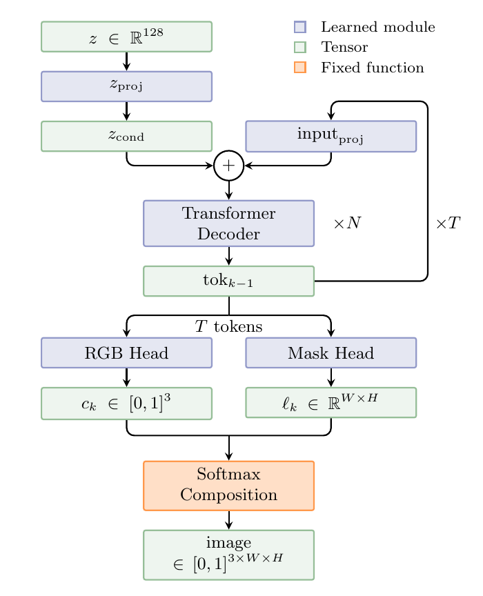
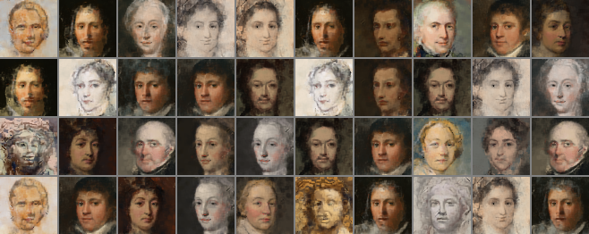
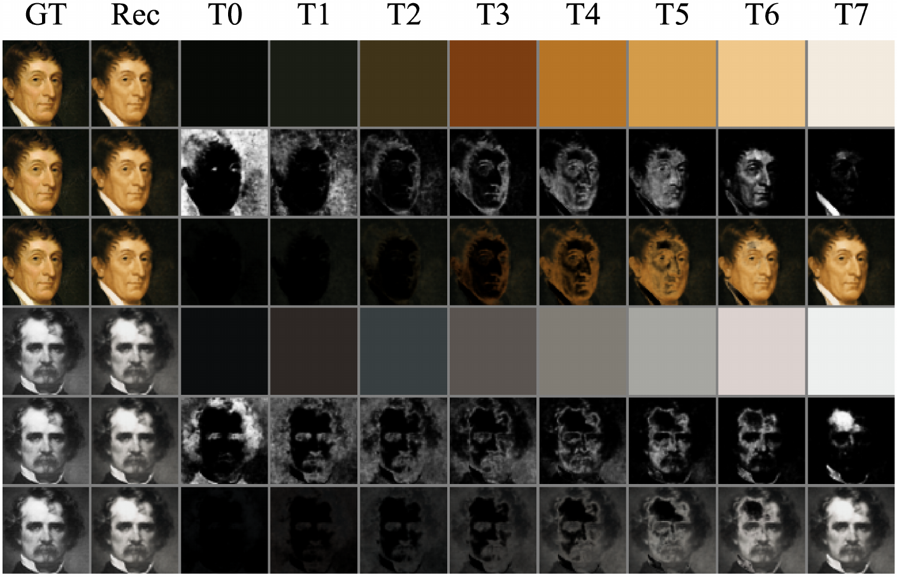

# Let Token Draw Itself

Official code for the paper **"Let Token Draw Itself"** (Yujing Tang, University of Chinese Academy of Sciences).

📄 **Paper**: [paper/TokenPainter.pdf](paper/TokenPainter.pdf)

TokenPainter is an autoregressive image generator in which **each token independently decodes
into its own RGB color and spatial mask**, composited via softmax into the final image.
Every generation step is therefore directly visible. Without auxiliary losses, softmax
competition alone drives tokens to spontaneously specialize into complementary spatial
regions, from broad silhouettes to fine details.

Training uses **GroupPos**, a GAN loss that normalizes discriminator scores within each
group via z-score and applies a soft non-negative threshold — no reference images and
no auxiliary reconstruction objectives are required.

## Architecture



A 128-dim latent vector $z$ is projected to a conditioning vector $z_\text{cond}$ and fed
to a 4-block causal Transformer decoder with RoPE. At each of the $T$ steps the decoder
produces one token, which is independently decoded by two per-token heads:

- **RGB Head** — 3-layer residual MLP with LayerNorm → color $c_k \in [0,1]^3$
- **Mask Head** — FC → PixelShuffle → conv refinement → logits $\ell_k \in \mathbb{R}^{H \times W}$

All tokens are composited via a pixel-wise softmax into a convex combination that forms
the final image. RoPE enables token count extrapolation at inference ($T$ can differ from
training) without any weight modification.

## Results

**Generated samples (T=8, trained with GroupPos)**



**Per-token decomposition** — token colors, masks, and cumulative build-up



| Model | Params |
|-------|--------|
| Generator (TokenPainter64) | 90.0M |
| Discriminator (df_dim=96) | 21.6M |

FID on MetFaces (64×64, 1000 generated samples): **74.4** at 902k img for $T{=}8$.

## Repository Structure

```
let-token-draw-itself/
├── TokenPainter/           # Generator
│   ├── model.py            # TokenPainter64 / TokenPainter32
│   ├── backbone.py         # RoPE causal Transformer decoder
│   └── heads.py            # RGB head / Mask head
├── sagan/                  # Discriminator (SAGAN-style, aligned with official TF impl)
├── shared/
│   ├── ada.py              # StyleGAN2-ADA augmentation pipeline
│   └── utils.py            # Grid/tensor helpers
├── training/
│   ├── train_gan_group.py  # GAN training with GroupPos
│   └── calc_fid.py         # FID evaluation
└── paper/TokenPainter.pdf  # Paper
```

## Quick Start

```bash
pip install -r requirements.txt

# GAN training with GroupPos (T=4 config from the paper's follow-up study)
python training/train_gan_group.py --data metfaces --model tp64 \
    --num_tokens 4 --df_dim 96 --g_batch 56 --d_batch 112 --ga_g 2 --ga_d 1 \
    --kimg 1000 --lr 2e-4 --lr_ratio 1.0 --g_lr 4e-4 --beta1 0.0 --beta2 0.9 \
    --ada --bf16 --r1_gamma 100 --r2_gamma 100 --r1r2_interval 4 \
    --ema --ema_kimg 10.0 --ckpt_interval 100 --seed 42 --run_name my_run
```

`--data` accepts either a name from the small registry in the script
(`metfaces`, `celeba`, …) or a direct path to a folder of PNG/JPG images
(MetFaces at 64×64 was used in the paper).
Checkpoints, samples, and logs are written to `runs/<run_name>_<timestamp>/`;
edit the paths at the top of `training/calc_fid.py` to evaluate them.

Training requires a CUDA GPU; the paper's runs were done on a single
RTX 3060 Laptop (6GB) with bf16 mixed precision.

## GroupPos

Inspired by group-based advantage normalization in GRPO:

```
adv_i = (s_i - μ) / σ          # global z-score over the batch (detached)
w_i   = softplus(adv_i · τ) / τ # soft non-negative gate
L_G   = -mean(w_i · s_i)        # only s_i carries gradient
```

Below-mean samples contribute negligible positive weight rather than negative weight,
which stabilizes training from scratch when the co-trained discriminator produces
noisy scores in early training.

## Citation

```bibtex
@misc{tang2026lettoken,
  title={Let Token Draw Itself},
  author={Tang, Yujing},
  year={2026}
}
```

## License

MIT
